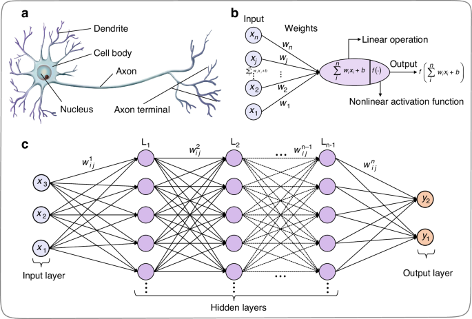

#  Foundations of Deep Learning — Theory Notebooks

This section introduces the **fundamental concepts** behind Deep Learning — starting from the distinction between **Machine Learning (ML)** and **Deep Learning (DL)**, and progressing through **Artificial Neural Networks (ANNs)**, the **Perceptron**, and the **Multi-Layer Perceptron (MLP)**.

---

##  Topics Covered

### 1. Machine Learning vs Deep Learning

| Machine Learning | Deep Learning |
|:--|:--|
| Learns patterns using statistical models and algorithms | Learns hierarchical representations using artificial neural networks |
| Works effectively with smaller datasets | Requires large amounts of data for effective learning |
| Relies on **manual feature extraction** | Performs **automatic feature extraction** |
| Easier to interpret and debug | More complex, works as a “black box” |
| Can be trained efficiently on CPUs | Often requires GPUs or TPUs |
| Faster training but limited scalability | Slower training but highly scalable and accurate for complex tasks |

---

### 2. What Are Deep Neural Networks (DNNs)?

A **Deep Neural Network (DNN)** extends a traditional **Artificial Neural Network (ANN)** by adding multiple hidden layers.  
Each layer transforms the data into higher-level abstractions, allowing the network to learn complex mappings.

**Mathematical Formulation:**

> **Forward propagation equations:**
>
> z(l) = W(l) · a(l−1) + b(l)  
> a(l) = σ(z(l))

**Where:**
- **W(l)** — weight matrix of layer *l*  
- **b(l)** — bias vector  
- **σ(·)** — activation function  
- **a(l−1)** — activations from the previous layer

---

### 3. The Perceptron — The Building Block

The **Perceptron** is the simplest form of a neural network, consisting of a single neuron that performs a linear combination of inputs and passes it through an activation function.

**Equation:**

> y = f(wᵀx + b)

**Where:**
- **w** — weight vector  
- **x** — input vector  
- **b** — bias term  
- **f(·)** — activation (step or sign function)

**Limitations:**
- Can only solve **linearly separable** problems (fails on XOR)
- No hidden layers → limited representation power

---

### 4. Multi-Layer Perceptron (MLP)

The **MLP** introduces **hidden layers** and **non-linear activation functions**, enabling the network to model complex patterns.

**Forward Propagation:**

> a(0) = x  
> z(l) = W(l) · a(l−1) + b(l)  
> a(l) = σ(z(l))

**Common Activation Functions:**

| Function | Formula | Description |
|:--|:--|:--|
| Sigmoid | 1 / (1 + e−x) | Smooth output between 0 and 1 |
| Tanh | (ex − e−x) / (ex + e−x) | Outputs between −1 and 1 |
| ReLU | max(0, x) | Fast and efficient for deep networks |

**Loss Function (MSE):**

> MSE = (1/n) Σ (yᵢ − ŷᵢ)²

---

## Recommended Reading

- **Hands-On Machine Learning with Scikit-Learn, Keras & TensorFlow** — Aurélien Géron (Ch. 10–11)  
- **Deep Learning Specialization** — Andrew Ng (Coursera)  
- **Deep Learning A–Z™** — Udemy  
- **3Blue1Brown YouTube Series** — *Neural Networks* and *Backpropagation*

---

## Sources & References

- [Deep Learning (DL) vs Machine Learning (ML): A Comparative Guide — DataCamp](https://www.datacamp.com/tutorial/machine-deep-learning)  
- [Introduction to Neural Networks — DataCamp](https://www.datacamp.com/tutorial/introduction-to-deep-neural-networks)  
- [Multilayer Perceptrons — DataCamp](https://www.datacamp.com/tutorial/multilayer-perceptrons-in-machine-learning)  
- [Neural Networks – A Beginner’s Guide — GeeksforGeeks](https://www.geeksforgeeks.org/machine-learning/neural-networks-a-beginners-guide/)

---

> This section builds the **theoretical foundation** for neural networks.  
