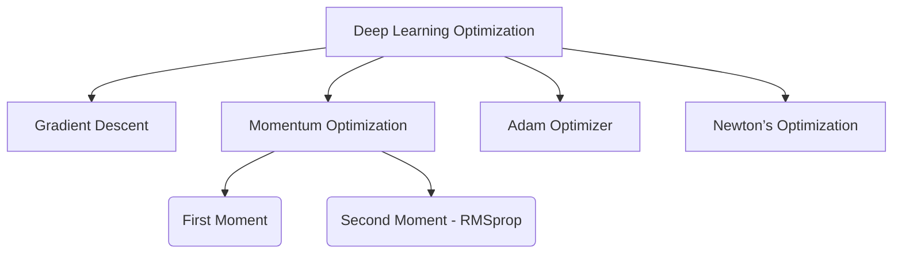
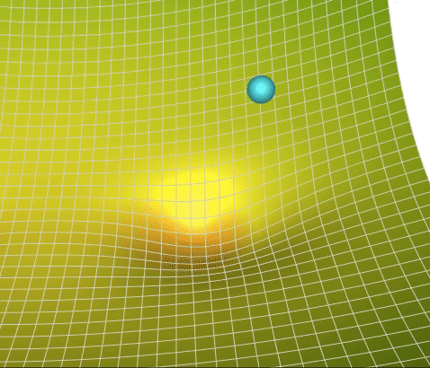
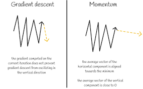
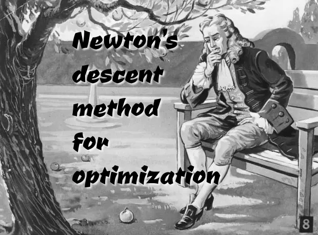

#  Optimization in Neural Networks

## Introduction
The foundation of neural network training lies in **Gradient Descent**.  
However, most neural networks are based on **non-convex loss functions** with **highly complex loss surfaces** — containing multiple local minima, saddle points, and flat regions.  

As a result, **vanilla Gradient Descent** often struggles to find the true global minimum:
- It may get trapped in **local minima**.  
- It can **oscillate** in narrow valleys.  
- It depends heavily on a properly chosen **learning rate**.  

To overcome these limitations, advanced optimizers such as **Momentum**, **Adam**, and **Newton’s Method** were developed.

---

## 1️. Gradient Descent — Overview

**Goal:** Minimize the loss function $( J(w) $) with respect to weights $( w $):

$$
w^{*} = \arg\min_{w} J(w)
$$

**Update Rule:**

$$
w_{t+1} = w_t - \eta \nabla_w J(w_t)
$$

**Limitations:**
- Sensitive to the choice of **learning rate** \( \eta \).  
- Can get **stuck** in local minima.  
- **Slow convergence** in flat regions.  
- **Oscillations** in steep or irregular loss surfaces.

---

## 2️. Momentum Optimization

Momentum introduces **memory** into gradient descent — it accumulates the direction of past gradients to build “velocity” that helps escape shallow minima and smooths oscillations.

### First Momentum (Classic Momentum)
**Idea:** Maintain an exponentially decaying moving average of past gradients.

**Update Equations:**

$$
m_{t+1} = \beta_1 m_t + (1 - \beta_1)\nabla_w J(w_t)
$$

$$
w_{t+1} = w_t - \eta m_{t+1}
$$

where $( \beta_1 \in [0.9, 0.99] $) controls the influence of past gradients.

---

### Second Momentum (Variance Term)
Tracks the **moving average of squared gradients**, controlling step size adaptively:

$$
v_{t+1} = \beta_2 v_t + (1 - \beta_2)(\nabla_w J(w_t))^2
$$

---

### Bias Correction
To counter early-step bias (since $( m_0 = v_0 = 0 $)):

$$
\hat{m}_t = \frac{m_t}{1 - \beta_1^t}, \quad 
\hat{v}_t = \frac{v_t}{1 - \beta_2^t}
$$

---

### Summary:
- **First Momentum →** direction (velocity)  
- **Second Momentum →** step size (adaptive scaling)  
- Combined, they form the basis for the **Adam optimizer**.
  

---

## 3️. Adam Optimizer (Adaptive Moment Estimation)

Adam combines both **momentum** and **adaptive learning rate** mechanisms.

**Equations:**

$$
m_{t+1} = \beta_1 m_t + (1 - \beta_1)\nabla_w J(w_t)
$$

$$
v_{t+1} = \beta_2 v_t + (1 - \beta_2)(\nabla_w J(w_t))^2
$$

$$
\hat{m}_{t+1} = \frac{m_{t+1}}{1 - \beta_1^{t+1}}, \quad
\hat{v}_{t+1} = \frac{v_{t+1}}{1 - \beta_2^{t+1}}
$$

$$
w_{t+1} = w_t - \eta \frac{\hat{m}_{t+1}}{\sqrt{\hat{v}_{t+1}} + \epsilon}
$$

**Typical Parameters:**  
$( \beta_1 = 0.9, \ \beta_2 = 0.999, \ \epsilon = 10^{-8} $)

**Advantages:**
- Fast convergence  
- Works well with sparse or noisy gradients  
- Minimal hyperparameter tuning required  

---

## 4️. Newton’s Method

Newton’s Method uses **second-order derivatives** to adjust the update direction and step size using curvature information (the Hessian matrix).

**Concept:**
Find $( x \) where \( f'(x) = 0 $), then iteratively update:

$$
x_{t+1} = x_t - \frac{f'(x_t)}{f''(x_t)}
$$

For optimization in multiple dimensions:

$$
w_{t+1} = w_t - H^{-1}\nabla_w J(w_t)
$$

where $( H $) is the **Hessian matrix** (matrix of second derivatives).

**Pros:**
- Quadratic convergence near minima  
- Adaptive step sizes via curvature  

**Cons:**
- Requires Hessian computation (expensive for large models)  
- Can converge to saddle points in non-convex surfaces  

---
| Feature / Optimizer            | SGD                                           | AdaGrad                                             | RMSprop                                                        | Adam                                                                 |
|--------------------------------|-----------------------------------------------|----------------------------------------------------|----------------------------------------------------------------|----------------------------------------------------------------------|
| **Learning Rate**               | Fixed learning rate                           | Adaptive, but decreases over time                 | Adaptive, based on recent gradient magnitudes                  | Adaptive, combines momentum and RMSprop-style learning rates         |
| **Momentum**                    | Optional (Momentum term can be added)        | No                                                 | No (momentum-like behavior via moving average of gradients)   | Yes, built-in momentum via moving averages of gradients              |
| **Gradient Scaling**            | Uniform across all parameters                 | Per-parameter scaling (based on historical gradients) | Per-parameter scaling (moving average of squared gradients)   | Per-parameter scaling (moving averages of first and second moments) |
| **Performance on Non-Convex Functions** | Struggles with non-convex functions, can get stuck in local minima | Struggles due to diminishing learning rates over time | Effective, especially on non-stationary and non-convex problems | Very effective due to adaptive learning rates and momentum           |
| **Convergence Speed**            | Slow without momentum                          | Slows down over time due to shrinking learning rate | Faster convergence compared to AdaGrad and SGD                | Fast convergence, especially on large and complex datasets           |
| **Hyperparameters**             | Learning rate (and momentum if used)          | Learning rate                                      | Learning rate, decay rate, epsilon                             | Learning rate, beta1, beta2, epsilon                                  |
| **Memory Usage**                 | Low                                           | High (accumulates squared gradients)              | Moderate (stores moving average of squared gradients)          | Higher (stores moving averages of gradients and squared gradients)   |
| **Use Cases**                    | Simple tasks, convex functions                | Sparse data, convex problems                       | RNNs, non-convex optimization problems, non-stationary objectives | Deep learning, large datasets, complex models (CNNs, RNNs)          |

---

> ⚡ **In short:**  
> Neural network optimization starts with Gradient Descent, improves with Momentum, adapts with Adam, and theoretically perfects with Newton’s Method — though practical constraints often decide which is used.

---

## References by Section

###  Gradient Descent
- [Mastering Gradient Descent: Optimizing Neural Networks with Precision – Medium (@ompramod)](https://ompramod.medium.com/mastering-gradient-descent-optimizing-neural-networks-with-precision-44056f9f32b0)
- [The Loss Surface of Multilayer Networks – Medium (@bekushal)](https://bekushal.medium.com/the-loss-surface-of-multilayer-networks-7936042564cd)

---

###  Momentum Optimization
- [Momentum in Optimization – Cornell University](https://optimization.cbe.cornell.edu/index.php?title=Momentum)
- [Momentum-Based Gradient Optimizer – GeeksforGeeks](https://www.geeksforgeeks.org/machine-learning/ml-momentum-based-gradient-optimizer-introduction/)
- [The Case for Momentum – Distill](https://distill.pub/2017/momentum/)

---

###  RMSProp Optimizer
- [RMSProp Optimizer Tutorial – DataCamp](https://www.datacamp.com/tutorial/rmsprop-optimizer-tutorial)
- [Understanding RMSProp: A Simple Guide – Medium (@piyushkashyap045)](https://medium.com/@piyushkashyap045/understanding-rmsprop-a-simple-guide-to-one-of-deep-learnings-powerful-optimizers-403baeed9922)
- [RMSProp Optimizer in Deep Learning – GeeksforGeeks](https://www.geeksforgeeks.org/deep-learning/rmsprop-optimizer-in-deep-learning/)

---

### Adam Optimizer
- [What is Adam Optimizer? – Analytics Vidhya](https://www.analyticsvidhya.com/blog/2023/09/what-is-adam-optimizer/)
- [Adam Optimizer – GeeksforGeeks](https://www.geeksforgeeks.org/deep-learning/adam-optimizer/)
- [Adam Optimizer Tutorial – DataCamp](https://www.datacamp.com/tutorial/adam-optimizer-tutorial)

---

###  Newton’s Method
- [Newton’s Method in Machine Learning – GeeksforGeeks](https://www.geeksforgeeks.org/machine-learning/newtons-method-in-machine-learning/)
- [Newton’s Method for Optimization in Python – Medium (@axegggl)](https://medium.com/@axegggl/newtons-method-for-optimization-in-python-11ce261fcf98)

