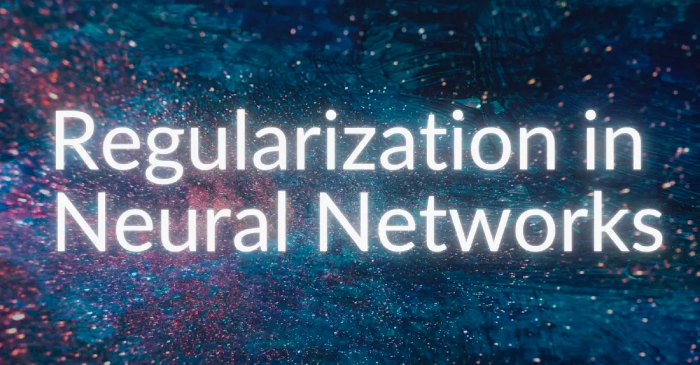

This repository contains organized notes, explanations, and resources on key **deep learning concepts** including **bias-variance tradeoff**, **regularization**, **dropout**, and **hyperparameter tuning**. It is intended as a comprehensive reference for learning and implementing deep learning models.

---
## Overfitting vs Underfitting
- Overfitting: 
  Learning the underlying patterns and noise in the training data.
  - High accuracy on training data but poor generalization on unseen data.
- Underfitting: The model is too simple to capture the patterns in the data.
  - Poor performance on both training and test data.

## Bias-Variance Tradeoff

- **Definition:** Understanding the tradeoff between model bias (underfitting) and variance (overfitting).  
- **Key Concepts:**
  - **Bias:** Systematic error due to overly simplified assumptions. High bias → underfitting.
  - **Variance:** Sensitivity to small changes in training data. High variance → overfitting.
---

##  Regularization & Dropout

### Regularization

- **Goal:** Prevent overfitting by adding a penalty term to the loss function.

$$
J_{\lambda}(w) = J(w) + \lambda R(w)
$$

Where:  
- $(J(w)$) → Data loss  
- $(\lambda R(w)$) → Regularization term

- **L1 Regularization (Lasso):**  
$$
L1 = \lambda \sum_{j=1}^{m} |w_j|
$$
Encourages sparsity by driving some weights to zero.

- **L2 Regularization (Ridge):**  
$$
L2 = \lambda \sum_{j=1}^{m} w_j^2 = \lambda W^T W
$$  
Shrinks weights but keeps all features.

- **Elastic Net (L1 + L2):**  
$$
Elastic\ Net = \lambda \sum_{j=1}^{m} \left( \beta |w_j| + \frac{1-\beta}{2} w_j^2 \right)
$$
Balances sparsity and stability, effective for correlated features.

### Dropout

- **Training:** Randomly deactivate neurons with a probability $(p$) (typical $(p=0.5$)).

$$
\text{Active Neurons} = \text{Neuron Output} \times \text{Bernoulli}(1-p)
$$

- **Inference:** All neurons active, weights scaled to maintain expected output:

$$
W_{\text{scaled}} = W \times (1-p)
$$
- **Effect:** Trains multiple “thinned” sub-networks, averages their outputs at test time, and improves generalization.

- **Best Practices:**  
  - Apply mostly in fully connected layers; use spatial dropout in convolutional layers.  
  - Avoid too high dropout rate (may cause underfitting).  
  - Turn off dropout during application deployment; scale weights instead.
---

## 🔧 Hyperparameter Tuning

- **Definition:** Settings external to the model that control training and model capacity. Cannot be learned from data.
- **Examples:** Learning rate, batch size, number of layers/neurons, dropout rate, etc.
- **Importance:** Proper tuning improves model performance; poor choices can lead to underfitting or overfitting.

- **Best Practices:**
  - Start with key hyperparameters.
  - Use cross-validation (e.g., k-fold).
  - Automate with frameworks like **scikit-learn** or **Wandb Sweeps**.
  - Track experiments with **Wandb** or similar tools.
  - Use learning curves to monitor performance.
  - Set resource/time budgets to avoid excessive computation.
---

## Summary Notes

- **Bias-Variance Tradeoff:** Balance underfitting and overfitting to generalize well.
- **Inductive Bias:** Embeds assumptions in architectures (CNN, RNN, Transformers) to guide learning.
- **Regularization:** L1, L2, Elastic Net, and Dropout improve generalization.
- **Dropout Mechanics:** Randomly zero neurons during training, scale weights during inference.
- **Hyperparameter Tuning:** Key for optimal performance, can be automated and tracked systematically.

# Reasource

[ A complete guide to regularization in neural networks](https://www.pinecone.io/learn/regularization-in-neural-networks/)

## Hyperparameter Tuning 

- **[Wandb: Introduction to MLOps & Hyperparameter Tuning](https://wandb.ai/site/articles/intro-to-mlops-hyperparameter-tuning/)**  
  An overview of MLOps and strategies for hyperparameter tuning.

- **[Wandb: Sweeps Tutorial](https://docs.wandb.ai/models/tutorials/sweeps)**  
  A guide to automating hyperparameter tuning using Wandb Sweeps.

- **[Medium: Automated Machine Learning Hyperparameter Tuning in Python](https://medium.com/data-science/automated-machine-learning-hyperparameter-tuning-in-python-dfda59b72f8a)**  
  A practical approach to automating hyperparameter tuning in Python.

- **[Kaggle: Automated Model Tuning](https://www.kaggle.com/code/willkoehrsen/automated-model-tuning)**  
  A Kaggle notebook demonstrating automated model tuning techniques.

- **[Cornell CS4780 Lecture Notes](https://www.cs.cornell.edu/courses/cs4780/2021fa/lectures/lecturenote11.html)**  
  Lecture notes covering hyperparameter tuning concepts.

---

## Bias-Variance Tradeoff

- **[Wikipedia: Bias–Variance Tradeoff](https://en.wikipedia.org/wiki/Bias%E2%80%93variance_tradeoff#:~:text=linear%20and%20Generalized%20linear%20models,the%20subject%20of%20recent%20debate.)**  
  A detailed explanation of the bias-variance tradeoff.

- **[Towards Data Science: AI Math - The Bias-Variance Trade-Off in Deep Learning](https://towardsdatascience.com/ai-math-the-bias-variance-trade-off-in-deep-learning-e444f80053dd/)**  
  A deep dive into the bias-variance tradeoff in deep learning.

---

## Dropout & Regularization

- **[Medium: A Simple Introduction to Dropout Regularization with Code](https://medium.com/analytics-vidhya/a-simple-introduction-to-dropout-regularization-with-code-5279489dda1e)**  
  Explains dropout regularization in neural networks with code examples.

- **[Pinecone: Regularization in Neural Networks](https://www.pinecone.io/learn/regularization-in-neural-networks/)**  
  A tutorial on different regularization methods for neural networks, including dropout.

- **[Medium: Dropout Regularization Technique](https://medium.com/@mangeshsalunke1309/dropout-regularization-technique-a770fbcd9692)**  
  Detailed explanation of dropout regularization technique.

- **[Machine Learning Mastery: A Gentle Introduction to Dropout](https://www.machinelearningmastery.com/dropout-for-regularizing-deep-neural-networks/)**  
  Beginner-friendly introduction to dropout regularization.

- **[Kaggle: What is Dropout Regularization?](https://www.kaggle.com/code/pavansanagapati/what-is-dropout-regularization-find-out)**  
  Kaggle notebook explaining dropout regularization.

