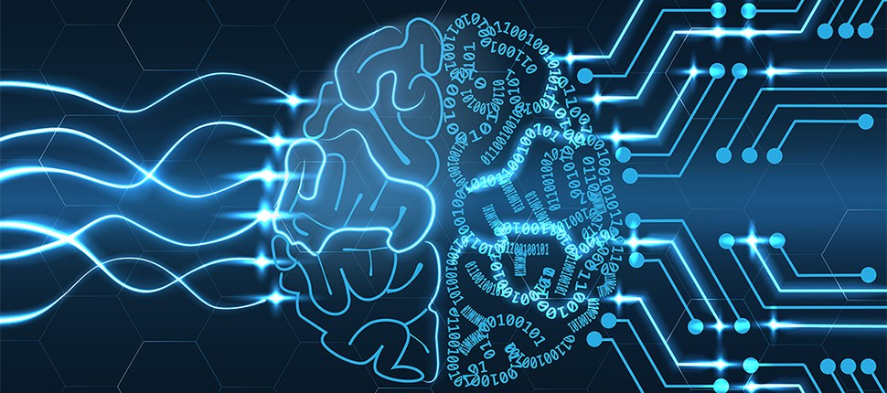

#  Hands-On in Deep Learning

> A personal deep learning roadmap and project collection — documenting my journey through theory, implementation, and experimentation in Deep Learning.

---
## Deep Learning Roadmap — Theory & Projects Overview

| **Main Section** | **Learning Type** | **Algorithm / Topic** | **Notebook / Project Link** |
|:--|:--|:--|:--|
| **FOUNDATIONS** | Theory | ML vs DL,Perceptron and MLP | [Introduction to Neural Networks](https://github.com/MohsenSafari83/hands-on-in-Deep-Learning/tree/main/Foundations/notebooks) |
|  | Project | Perceptron / MLP Implementation | [ MLP Project](./0_Foundations/projects/MLP_Project) |
| **ARCHITECTURES** | Computer Vision | Convolutional Neural Networks (CNNs) | [ CNN Theory](./1_Architectures/notebooks/CNNs.ipynb) |
|  | Project | Image Classification using CNN | [ CNN Project](./1_Architectures/projects/CNN_Image_Classifier) |
|  | Sequential Modeling | Recurrent Neural Networks (RNNs) / LSTM / GRU | [RNN Theory](./1_Architectures/notebooks/RNNs_LSTM.ipynb) |
|  | Project | Sentiment Analysis (LSTM-based) | [ NLP Project](./1_Architectures/projects/Sentiment_Analysis) |
| **ADVANCED NETWORKS** | Generative Modeling | Autoencoders | [ Autoencoder Theory](./2_Advanced/Autoencoders.ipynb) |
|  | Generative Modeling | Generative Adversarial Networks (GANs) | [ GANs Notebook](./2_Advanced/GANs.ipynb) |
|  | NLP | Transformer Architecture / Attention | [ Transformers Theory](./2_Advanced/Transformers.ipynb) |
|  | Project | Text Generation using Transformer | [Transformer Project](./2_Advanced/projects/Text_Generation) |
| **OPTIMIZATION & TRAINING** | Core Concepts | Backpropagation / Gradient Descent | [ Optimization Notebook](./3_Optimization_Training/Backpropagation.ipynb) |
|  | Regularization | Dropout / Batch Normalization | [ Regularization Notebook](./3_Optimization_Training/Regularization.ipynb) |
|  | Project | Training MLP with Backpropagation | [ MLP Training Project](./3_Optimization_Training/projects/MLP_Backprop) |
| **APPLICATIONS** | Computer Vision | Object Detection (YOLO / SSD) | [ Object Detection Project](./4_Applications/CV_Object_Detection) |
|  | Reinforcement Learning | Deep Q-Learning | [ RL Project](./4_Applications/RL_DeepQLearning) |

> This roadmap connects theoretical notebooks and hands-on projects in a progressive learning path —  
> starting from the Perceptron to advanced architectures like Transformers and GANs.
---
## Purpose

This repository serves as my **personal learning roadmap** for Deep Learning (DL) — a structured and practical path covering both theory and projects.  
It aims to:
- Strengthen understanding of **core deep learning concepts**
- Implement and experiment with various **neural architectures**
- Build a portfolio of **hands-on projects**
- Track continuous progress in my AI learning journey

---

##  Machine Learning vs Deep Learning

| Machine Learning | Deep Learning |
|:--|:--|
| Applies statistical algorithms to learn hidden patterns and relationships in the dataset. | Uses artificial neural network architectures to learn hidden patterns and relationships in the dataset. |
| Can work with smaller datasets. | Requires large volumes of data for effective training. |
| Better for low-complexity or low-label tasks. | Better for complex tasks like image processing and natural language processing. |
| Takes less time to train. | Takes more time to train. |
| Relies on manually extracted features. | Automatically extracts relevant features (end-to-end learning). |
| Easier to interpret results. | Harder to interpret (“black-box” nature). |
| Works efficiently on CPUs. | Requires high-performance GPUs or TPUs. |

---

## Evolution of Neural Architectures

### **Perceptron (1950s)**
- First simple neural network with a single layer  
- Solved only linearly separable problems  
- Failed on tasks like XOR  

### **Multi-Layer Perceptrons (MLPs)**
- Introduced hidden layers and nonlinear activations  
- Enabled modeling of nonlinear relationships  
- Trained using **backpropagation** — a major leap forward  

---

##  Types of Neural Networks

### **1. Feedforward Neural Networks (FNNs)**
Data flows in one direction from input to output.  
Used for basic tasks such as classification and regression.

### **2. Convolutional Neural Networks (CNNs)**
Specialized for **grid-like data** (e.g., images).  
Use convolutional layers to detect spatial hierarchies — ideal for **computer vision**.

### **3. Recurrent Neural Networks (RNNs)**
Designed for **sequential data** (e.g., time series, text).  
Have loops to retain information over time.  
Variants such as **LSTMs** and **GRUs** mitigate vanishing gradient problems.

### **4. Generative Adversarial Networks (GANs)**
Consist of a **Generator** and a **Discriminator** competing with each other.  
Used for **image generation**, **style transfer**, and **data augmentation**.

### **5. Autoencoders**
Unsupervised models that learn compact data encodings.  
Useful for **dimensionality reduction**, **denoising**, and **anomaly detection**.

### **6. Transformer Networks**
Revolutionized NLP with **self-attention mechanisms**.  
Power models like **BERT** and **GPT**, excelling in **translation**, **text generation**, and **semantic understanding**.

---

##  Applications of Deep Learning

### **1. Computer Vision**
- **Object Detection & Recognition:** Detect and locate objects (self-driving cars, surveillance)  
- **Image Classification:** Categorize images (medical imaging, quality control)  
- **Image Segmentation:** Separate image regions for detailed feature extraction  

### **2. Natural Language Processing (NLP)**
- **Text Generation:** Generate text like summaries or essays  
- **Language Translation:** Translate text between languages  
- **Sentiment Analysis:** Identify emotional tone (positive, negative, neutral)  
- **Speech Recognition:** Convert spoken words to text  

### **3. Reinforcement Learning**
- **Game Playing:** Agents outperform humans in Go, Chess, Atari  
- **Robotics:** Learn complex control tasks (grasping, navigation)  
- **Control Systems:** Optimize power grids, traffic flow, supply chains  

---

## Advantages vs Challenges in Deep Learning

| **Category** | **Description** |
|:--|:--|
| **High Accuracy** | Achieves state-of-the-art results across various domains such as computer vision and NLP. |
| **Automated Feature Learning** | Learns relevant features directly from raw data without manual feature engineering. |
| **Scalability** | Efficiently scales to handle large and complex datasets. |
| **Flexibility** | Can be applied to images, text, speech, and structured data. |
| **Continuous Improvement** | Performance often improves as more data and compute power are available. |

---

| **Challenges / Limitations** | **Description** |
|:--|:--|
| **Data Requirements** | Requires large, high-quality datasets for effective training. |
| **Computational Cost** | Training is resource-intensive and often needs GPUs or TPUs. |
| **Interpretability** | Models behave like “black boxes,” making results hard to explain. |
| **Overfitting** | Models can memorize training data, reducing generalization. |
| **Hyperparameter Sensitivity** | Requires extensive tuning (learning rate, batch size, etc.) for optimal results. |
| **Energy Consumption** | Large-scale models consume significant computational energy. |

## 🌳 Project Tree Overview
```
hands-on-in Deep Learning /
│
├── 0_Foundations/
│   ├── README.md                     # Concepts overview (math, ML vs DL, perceptron)
│   ├── notebooks/                    # Jupyter notebooks (step-by-step explanations)
│   │   ├── Introduction_to_Neural_Networks.ipynb
│   │   └── README.md
│   └── projects/                     # Small related projects
│       ├── perceptron_classifier/
│       └── README.md
│
├── 1_ANN_and_MLP/
│   ├── README.md                     # ANN/MLP theory (architecture, forward/backprop)
│   ├── notebooks/
│   │   ├── ann_forward_pass.ipynb
│   │   └── mlp_from_scratch.ipynb
│   └── projects/
│       ├── mnist_mlp_classifier/
│       │   ├── model.py
│       │   ├── train.py
│       │   ├── evaluate.py
│       │   ├── requirements.txt
│       │   └── README.md
│       └── regression_with_ann/
│
├── 2_CNN/
│   ├── README.md
│   ├── notebooks/
│   │   ├── cnn_intro.ipynb
│   │   ├── filters_and_convolution.ipynb
│   │   └── cnn_with_keras.ipynb
│   └── projects/
│       ├── cifar10_cnn/
│       └── image_classification_transfer_learning/
│
├── 3_RNN_and_LSTM/
│   ├── README.md
│   ├── notebooks/
│   │   ├── rnn_intro.ipynb
│   │   └── lstm_text_generation.ipynb
│   └── projects/
│       ├── sentiment_analysis_rnn/
│       └── time_series_forecasting_lstm/
│
├── 4_Transformers/
│   ├── README.md
│   ├── notebooks/
│   │   ├── self_attention_mechanism.ipynb
│   │   └── transformer_architecture.ipynb
│   └── projects/
│       ├── text_translation_transformer/
│       └── question_answering_BERT/
│
├── 5_Generative_Models/
│   ├── README.md
│   ├── notebooks/
│   │   ├── autoencoder_basics.ipynb
│   │   ├── gan_intro.ipynb
│   │   └── variational_autoencoder.ipynb
│   └── projects/
│       ├── face_generation_GAN/
│       └── image_denoising_autoencoder/
│
├── 6_Reinforcement_Learning/
│   ├── README.md
│   ├── notebooks/
│   │   ├── rl_intro.ipynb
│   │   └── q_learning.ipynb
│   └── projects/
│       ├── cartpole_agent/
│       └── game_ai_with_dqn/
├── requirements.txt
└── README.md                       # Main overview and roadmap

```
## Resources for Deep Learning

A curated collection of essential books, courses, and documentation that form the foundation of deep learning knowledge and practical skills.

---

### Books

- **Hands-On Machine Learning with Scikit-Learn, Keras, and TensorFlow** — *Aurélien Géron*  
  Comprehensive guide covering both theory and implementation in TensorFlow and Keras.  
  [GitHub Repository: ageron/handson-ml2](https://github.com/ageron/handson-ml2)

- **Deep Learning** — *Ian Goodfellow, Yoshua Bengio, Aaron Courville*  
  Theoretical foundation of neural networks and modern deep learning.

---

###  Online Courses

- **Deep Learning Specialization** — *Andrew Ng* (Coursera)  
  Five-course specialization introducing neural networks, CNNs, RNNs, and sequence models.  
   [Coursera: Deep Learning Specialization](https://www.coursera.org/specializations/deep-learning)

- **Deep Learning A–Z™: Hands-On Artificial Neural Networks** — *Udemy (Kirill Eremenko, Hadelin de Ponteves)*  
  Practical deep learning course with hands-on projects covering **ANNs**, **CNNs**, **RNNs**, **SOMs**, and **Boltzmann Machines**.  
   [Udemy: Deep Learning A–Z™](https://www.udemy.com/course/deeplearning/)

- **[Machine Learning and deep learning (Ali Sharifi Zarchi) ](https://ocw.sharif.ir/course/id/545/%DB%8C%D8%A7%D8%AF%DA%AF%DB%8C%D8%B1%DB%8C-%D9%85%D8%A7%D8%B4%DB%8C%D9%86)**  
        [GitHub Repository](https://github.com/SharifiZarchi/Introduction_to_Machine_Learning/tree/main)
---

### Libraries & Frameworks

- **TensorFlow** — Official library for large-scale machine learning and deep learning.  
  📖 [TensorFlow Documentation](https://www.tensorflow.org/)

- **Keras** — High-level neural networks API running on top of TensorFlow.  
  📖 [Keras Documentation](https://keras.io/)

- **scikit-learn** — Essential toolkit for traditional ML models and preprocessing.  
  📖 [scikit-learn Documentation](https://scikit-learn.org/stable/documentation.html)

- **NumPy** — Core library for numerical computing in Python.  
  📖 [NumPy Documentation](https://numpy.org/doc/stable/)

- **pandas** — Data manipulation and analysis library.  
  📖 [pandas Documentation](https://pandas.pydata.org/docs/)

- **Matplotlib** — Plotting and visualization library.  
  📖 [Matplotlib Documentation](https://matplotlib.org/stable/contents.html)

- **Seaborn** — Statistical data visualization built on top of Matplotlib.  
  📖 [Seaborn Documentation](https://seaborn.pydata.org/)

- **DataCamp** — Online learning platform for Python, ML, and AI.  
  🌐 [DataCamp](https://www.datacamp.com/)

- **GeeksforGeeks – Machine Learning Tutorials**  
  Beginner-friendly tutorials and conceptual explanations.  
  🌐 [GeeksforGeeks ML Tutorials](https://www.geeksforgeeks.org/machine-learning/)

---

### Suggested Learning Path

1. Start with **Hands-On Machine Learning** by Aurélien Géron (for foundational DL coding).
2. Follow **Andrew Ng’s Deep Learning Specialization** (for conceptual mastery).
3. Experiment with **TensorFlow** and **PyTorch** tutorials (for implementation).
4. Reinforce learning by replicating small projects (MNIST, CIFAR-10, text classification).
5. Gradually move toward **Transformers**, **GANs**, and **Reinforcement Learning** topics.

---

> *"The best way to learn deep learning is to build, test, fail, and iterate — again and again."*

---
## Connect with me
- [Telegram](https://t.me/Mohsenn_sri)
- [linkedin](https://www.linkedin.com/in/mohsenn-safari)

